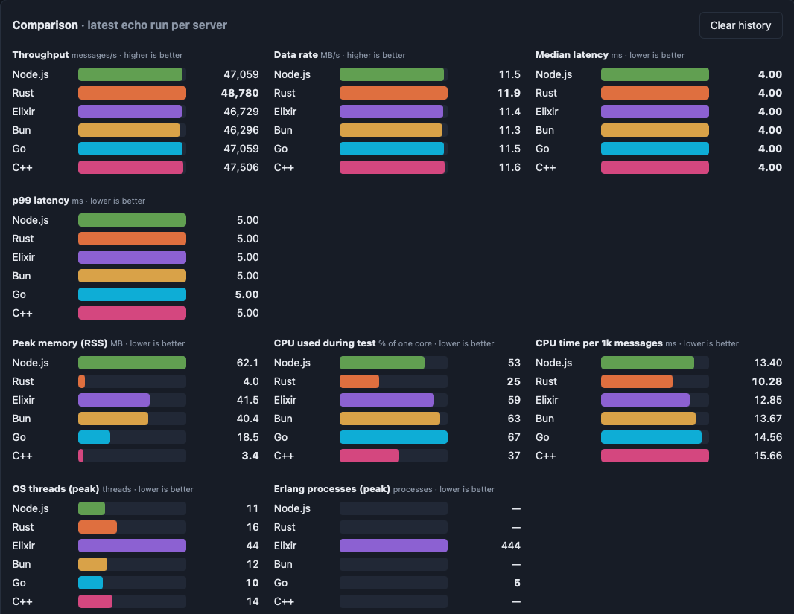

# WebSocket speed test: Node.js vs Rust vs Elixir vs Bun vs Go vs C++

Six equivalent WebSocket servers and one Svelte client that benchmarks them.

| Project          | Stack                         | Port | Run                                              |
|------------------|-------------------------------|------|--------------------------------------------------|
| `node-server/`   | Node.js + `ws`                | 8081 | `npm install && npm start`                       |
| `rust-server/`   | Rust + tokio-tungstenite      | 8082 | `cargo run --release`                            |
| `elixir-server/` | Elixir + Bandit/WebSock       | 8083 | `mix deps.get && MIX_ENV=prod mix run --no-halt` |
| `bun-server/`    | Bun (`Bun.serve`)             | 8084 | `bun run server.ts`                              |
| `go-server/`     | Go + gorilla/websocket        | 8085 | `go mod tidy && go run .`                        |
| `cpp-server/`    | C++17 + Boost.Beast           | 8086 | `cmake -S . -B build && cmake --build build -j && build/speed_server` |
| `client/`        | Svelte 5 + Vite SPA           | 5173 | `npm install && npm run dev`                     |

Set `PORT` to change a server's port; the client lets you edit each URL (`ws://localhost:PORT/ws`).
Always benchmark Rust with `--release` and Elixir with `MIX_ENV=prod`.

## Protocol

Each connection has a mode, `echo` (default) or `generate`.

Text frames starting with `@` are control messages (JSON after the `@`). Everything else is data.

| Client sends                                  | Server does                                                              |
|-----------------------------------------------|--------------------------------------------------------------------------|
| `@{"cmd":"mode","mode":"echo"\|"generate"}`   | Switches mode, replies `@{"evt":"info","server","runtime","mode"}`       |
| `@{"cmd":"info"}`                             | Replies with the same info message                                       |
| `@{"cmd":"stats"}` (any mode)               | Replies `@{"evt":"stats", ...}` (see below)                                |
| any other frame (text or binary), echo mode   | Echoes the frame back unchanged                                          |
| `@{"cmd":"start","count":N,"size":S}`, generate mode | Streams N text frames `"<seq>\|<S bytes of x>"`, then `@{"evt":"done","count","size","serverMs"}` |

### Stats

Every server answers `stats` with the same shape: `pid`, `uptimeS`, `cpuCores`, `rssMB` (OS resident memory),
`heapMB` (runtime-managed memory; `null` for Rust), `threads` (OS threads), `processes` (Erlang processes or Go goroutines; `null` elsewhere),
`connections`, `msgsIn`, `msgsOut`, `cpuMs` (cumulative user+system CPU time) and an `extra` object with runtime-specific
values (Node event-loop delay, Go GC stats, C++ IO thread count, Tokio workers, BEAM schedulers/run queue/memory breakdown, ...).

During each test the client polls `stats` on a separate connection every 400 ms and reports peak memory, peak threads/processes,
and CPU % (100% = one core fully busy; can exceed 100% on multiple cores). RSS and thread counts come from `ps` (or `/proc` on Linux).

The server never parses data frames; only the first byte is checked. Generation honours TCP backpressure on all six servers.

## What the client measures

- **Echo**: sends N messages keeping a configurable window in flight (window 1 = pure round-trip latency; larger = throughput). Reports msgs/s, MB/s and avg/p50/p95/p99/max latency. Supports text or binary frames, several parallel connections, and a warm-up pass.
- **Generate**: asks the server to produce N messages and reports msgs/s, MB/s, time to first message, server-side generate time, and verifies every message arrived in order.

The benchmark runs in a Web Worker so UI rendering doesn't skew timings. Results are compared in bar charts (latest run per server) and a history table. A Playground panel lets you poke a server manually.

Caveat: the browser is the load generator. For very fast servers (Rust especially) the client can become the bottleneck; use more connections to push harder.
# ws_server_tests
